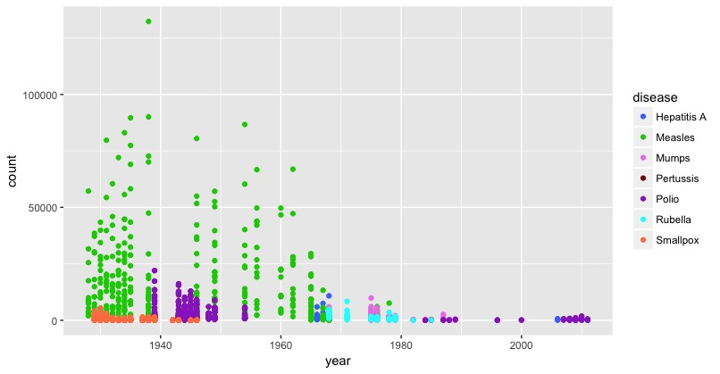

**Author:** Tori Larson

__*Project Description:*__
The purpose of this project was to analyze a data set for 20 minutes and asking questions about the dataset before beginning to work with it. I chose to work with disease data by state from the years 1928 - 2011. Below are the questions that I had followed by the answers. Refer to R-script for all of my work.

**1. What was the total measles count for Hawaii vs. the United States average measle count in 1960.**

  **1A. Total Measles Count for Hawaii in 1960?**

        5322

  **1B. Average United States Measles Count for 1960**

        8474.92

**2. Which which year and state had the highest count (recorded for 52 weeks) for each disease.**

|Disease|State|Year|Count|
|----|----|----|----|
|Hepatitis A|California|1968| 10,821|
|Measles| Pennsylvania|1938|132,342|
|Mumps|Michigan|1975|9867|
|Pertussis|New York| 1939| 22013|
|Polio|New York| 1939| 22013|
|Rubella| California| 1971| 8384|
|Smallpox| Indiana| 1930|5239|

**2B. Compare the Year/State count to the Year/USA Count. What is the individual states overall percentage in relation to the nation.**

|Year|Disease|State|State Count|USA Count| Percentage|
|----|----|----|----|----|----|
|1968|Hepatitis A|California| 10,821|29,804|36.3%|
|1938|Measles| Pennsylvania|132,342|620,916|21.3%|
|1975|Mumps|Michigan|9867|49271|20.0%|
|1939|Pertussis|New York| 22013|185,222|11.9%|
|1939|Polio|New York| 22013|185222|11.9%|
|1971|Rubella|California| 8384|185,222|26.2%
|1930|Smallpox|Indiana|5239|44,027|11.9|

## 52 Week Data

